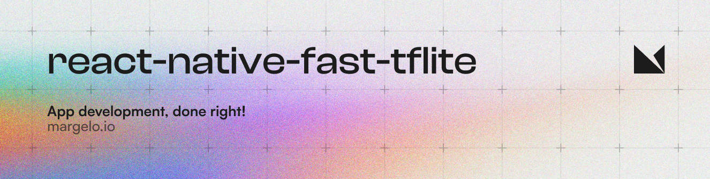
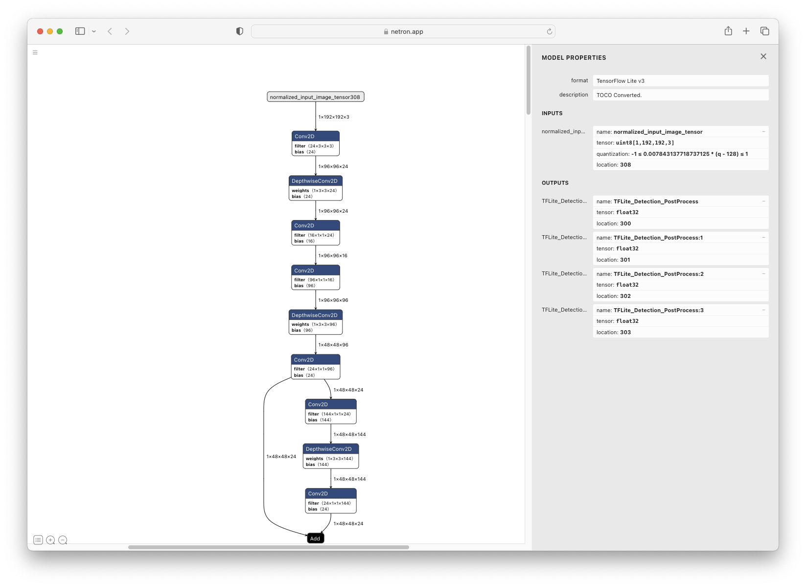
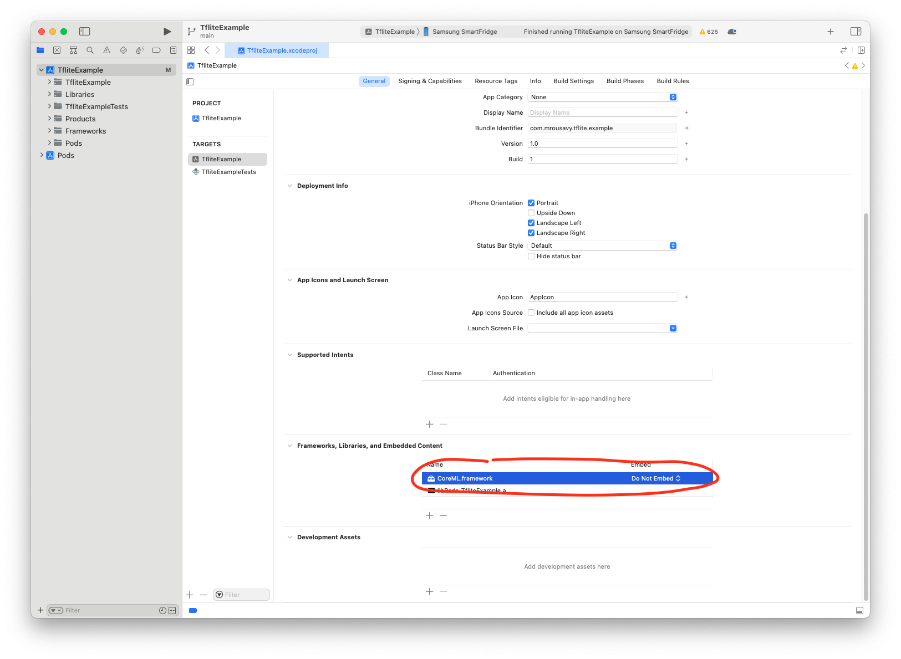

<a href="https://margelo.io">
  <picture>
    <source media="(prefers-color-scheme: dark)" srcset="./img/banner-dark.png" />
    <source media="(prefers-color-scheme: light)" srcset="./img/banner-light.png" />
    
  </picture>
</a>

<br />

A high-performance [TensorFlow Lite](https://www.tensorflow.org/lite) library for React Native.

- 🔥 Powered by JSI
- 💨 Zero-copy ArrayBuffers
- 🔧 Uses the low-level C/C++ TensorFlow Lite core API for direct memory access
- 🔄 Supports swapping out TensorFlow Models at runtime
- 🖥️ Supports GPU-accelerated delegates (CoreML/Metal/OpenGL)
- 📸 Easy [VisionCamera](https://github.com/mrousavy/react-native-vision-camera) integration

## Installation

1. Add the npm package
   ```sh
   yarn add react-native-fast-tflite
   ```
2. In `metro.config.js`, add `tflite` as a supported asset extension:
   ```js
   module.exports = {
       // ...
       resolver: {
           assetExts: ['tflite', // ...
           // ...
   ```
   This allows you to drop `.tflite` files into your app and swap them out at runtime without having to rebuild anything! 🔥
3. (Optional) If you want to enable the GPU Delegate, see ["Using GPU Delegates"](#using-gpu-delegates) down below.
4. Run your app (`yarn android` / `npx pod-install && yarn ios`)

## Usage

1. Find a TensorFlow Lite (`.tflite`) model you want to use. There's thousands of public models on [tfhub.dev](https://tfhub.dev).
2. Drag your TensorFlow Lite model into your React Native app's asset folder (e.g. `src/assets/my-model.tflite`)
3. Load the Model:

   ```ts
   // Option A: Standalone Function
   const model = await loadTensorflowModel(require('assets/my-model.tflite'))

   // Option B: Hook in a Function Component
   const plugin = useTensorflowModel(require('assets/my-model.tflite'))
   ```

4. Call the Model:
   ```ts
   const inputData = ...
   const outputData = await model.run(inputData)
   console.log(outputData)
   ```

### Loading Models

Models can be loaded either from the React Native bundle using a `require(..)` statement, or any kind of URI/URL (`http://..` or `file://..`):

```ts
// Asset from React Native Bundle
loadTensorflowModel(require('assets/my-model.tflite'))
// File on the local filesystem
loadTensorflowModel({ url: 'file:///var/mobile/.../my-model.tflite' })
// Remote URL
loadTensorflowModel({
  url: 'https://tfhub.dev/google/lite-model/object_detection_v1.tflite',
})
```

Loading a Model is asynchronous since Buffers need to be allocated. Make sure to check for any potential errors when loading a Model.

### Input and Output data

TensorFlow uses _tensors_ as input and output formats. Since TensorFlow Lite is optimized to run on fixed array sized byte buffers, you are responsible for interpreting the raw data yourself.

To inspect the input and output tensors on your TensorFlow Lite model, open it in [Netron](https://netron.app).

For example, the `object_detection_mobile_object_localizer_v1_1_default_1.tflite` model I found on [tfhub.dev](https://tfhub.dev) has **1 input tensor** and **4 output tensors**:



In the description on [tfhub.dev](https://tfhub.dev) we can find the description of all tensors:


From that we now know that we need a 192 x 192 input image with 3 bytes per pixel (meaning RGB).

#### Usage (VisionCamera)

If you were to use this model with a [VisionCamera](https://github.com/mrousavy/react-native-vision-camera) Frame Processor, you would need to convert the Frame to a 192 x 192 x 3 byte array.
To do the conversion, use [vision-camera-resize-plugin](https://github.com/mrousavy/vision-camera-resize-plugin):

```tsx
const objectDetection = useTensorflowModel(require('object_detection.tflite'))
const model =
  objectDetection.state === 'loaded' ? objectDetection.model : undefined

const { resize } = useResizePlugin()

const frameProcessor = useFrameProcessor(
  (frame) => {
    'worklet'
    if (model == null) return

    // 1. Resize 4k Frame to 192x192x3 using vision-camera-resize-plugin
    const resized = resize(frame, {
      scale: {
        width: 192,
        height: 192,
      },
      pixelFormat: 'rgb',
      dataType: 'uint8',
    })

    // 2. Run model with given input buffer synchronously
    const outputs = model.runSync([resized])

    // 3. Interpret outputs accordingly
    const detection_boxes = outputs[0]
    const detection_classes = outputs[1]
    const detection_scores = outputs[2]
    const num_detections = outputs[3]
    console.log(`Detected ${num_detections[0]} objects!`)

    for (let i = 0; i < detection_boxes.length; i += 4) {
      const confidence = detection_scores[i / 4]
      if (confidence > 0.7) {
        // 4. Draw a red box around the detected object!
        const left = detection_boxes[i]
        const top = detection_boxes[i + 1]
        const right = detection_boxes[i + 2]
        const bottom = detection_boxes[i + 3]
        const rect = SkRect.Make(left, top, right, bottom)
        canvas.drawRect(rect, SkColors.Red)
      }
    }
  },
  [model]
)

return <Camera frameProcessor={frameProcessor} {...otherProps} />
```

### Using GPU Delegates

GPU Delegates offer faster, GPU accelerated computation. There's multiple different GPU delegates which you can enable:

#### CoreML (iOS)

To enable the CoreML Delegate, you must configure react-native-fast-tflite to include it in the build.

##### Expo

For Expo, just use the config plugin in your expo config (`app.json`, `app.config.json` or `app.config.js`):

```json
{
  "name": "my app",
  "plugins": [
    [
      "react-native-fast-tflite",
      {
        "enableCoreMLDelegate": true
      }
    ]
  ]
}
```

##### Bare React Native

If you are on bare React Native, you need to include the CoreML/Metal code in your project:

1. Set `$EnableCoreMLDelegate` to true in your `Podfile`:

   ```ruby
   $EnableCoreMLDelegate=true

   # rest of your podfile...
   ```

2. Open your iOS project in Xcode and add the `CoreML` framework to your project:
   
3. Re-install Pods and build your app:
   ```sh
   cd ios && pod install && cd ..
   yarn ios
   ```
4. Use the CoreML Delegate:
   ```ts
   const model = await loadTensorflowModel(
     require('assets/my-model.tflite'),
     'core-ml'
   )
   ```

> [!NOTE]
> Since some operations aren't supported on the CoreML delegate, make sure your Model is able to use the CoreML GPU delegate.

#### Android GPU/NNAPI (Android)

To enable GPU or NNAPI delegate in Android, you **may** need to include some native libraries, starting from Android 12.

##### Expo

For Expo, just use the config plugin in your expo config (`app.json`, `app.config.json` or `app.config.js`) with `enableAndroidGpuLibraries`:

```json
{
  "name": "my app",
  "plugins": [
    [
      "react-native-fast-tflite",
      {
        "enableAndroidGpuLibraries": true
      }
    ]
  ]
}
```

By default, when enabled, `libOpenCl.so` will be included in your AndroidManifest.xml. You can also include more libraries by passing an array of string:

```json
{
  "name": "my app",
  "plugins": [
    [
      "react-native-fast-tflite",
      {
        "enableAndroidGpuLibraries": ["libOpenCL-pixel.so", "libGLES_mali.so"]
      }
    ]
  ]
}
```

> [!NOTE]
> For expo app, remember to run prebuild if the cpu library is not yet included in your AndroidManifest.xml.

##### Bare React Native

If you are on bare React Native, you will need to include all needed libraries with `uses-native-library` on `application` scope in AndroidManifest.xml.

```xml
<!-- Like this -->
<uses-native-library android:name="libOpenCL.so" android:required="false" />

<!-- You may need one/all of the followings depends on your targeting devices -->
<uses-native-library android:name="libOpenCL-pixel.so" android:required="false" />
<uses-native-library android:name="libGLES_mali.so" android:required="false" />
<uses-native-library android:name="libPVROCL.so" android:required="false" />
```

Then, you can just use it:

```ts
const model = await loadTensorflowModel(
  require('assets/my-model.tflite'),
  'android-gpu'
)
// or
const model = await loadTensorflowModel(
  require('assets/my-model.tflite'),
  'nnapi'
)
```

> [!WARNING]
> NNAPI is deprecated on Android 15. Hence, it is not recommended in future projects.
> Both has similiar performance, but GPU delegate has better initial loading time.

> [!NOTE]
> Android does not provide support for OpenCL officially, however, most gpu vendors do provide support for it.

## Community Discord

[Join the Margelo Community Discord](https://discord.gg/6CSHz2qAvA) to chat about react-native-fast-tflite or other Margelo libraries.

## Adopting at scale

<a href="https://github.com/sponsors/mrousavy">
  
</a>

This library is provided _as is_, I work on it in my free time.

If you're integrating react-native-fast-tflite in a production app, consider [funding this project](https://github.com/sponsors/mrousavy) and <a href="mailto:me@mrousavy.com?subject=Adopting react-native-fast-tflite at scale">contact me</a> to receive premium enterprise support, help with issues, prioritize bugfixes, request features, help at integrating react-native-fast-tflite and/or VisionCamera Frame Processors, and more.

## Contributing

1. Clone the repo
2. Make sure you have installed Xcode CLI tools such as `gcc`, `cmake` and `python`/`python3`. See the TensorFlow documentation on what you need exactly.
3. Run `yarn bootstrap` and select `y` (yes) on all iOS and Android related questions.
4. Open the Example app and start developing
   - iOS: `example/ios/TfliteExample.xcworkspace`
   - Android: `example/android`

See the [contributing guide](CONTRIBUTING.md) to learn how to contribute to the repository and the development workflow.

## License

MIT
